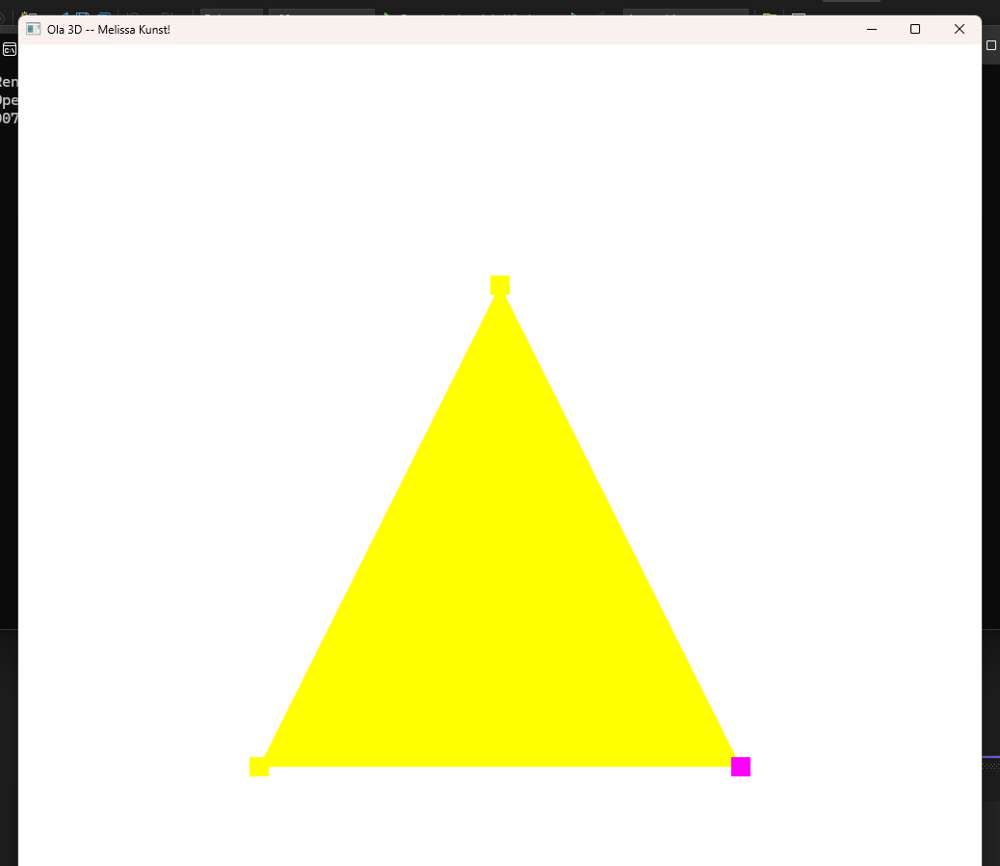
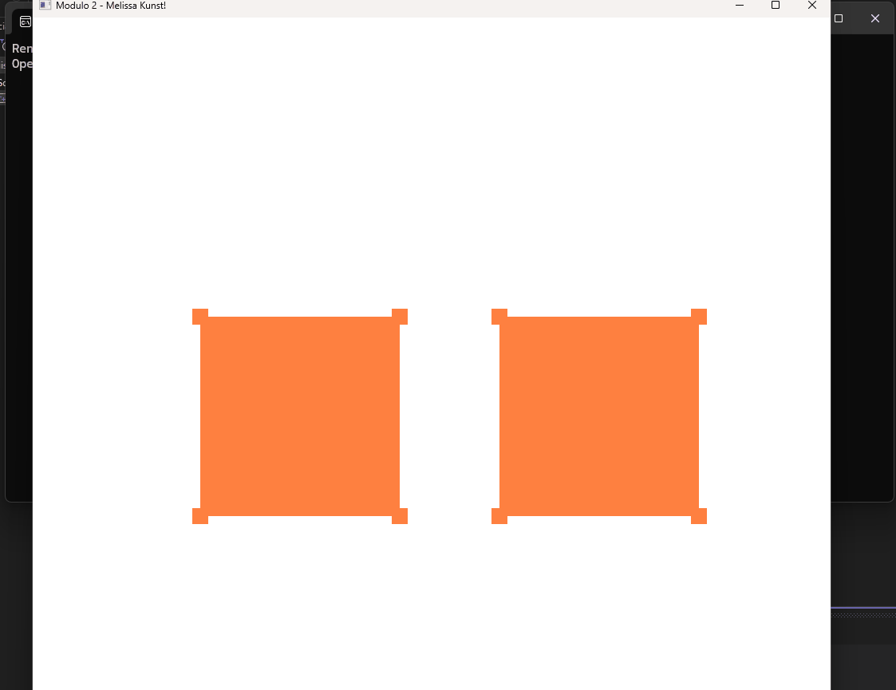
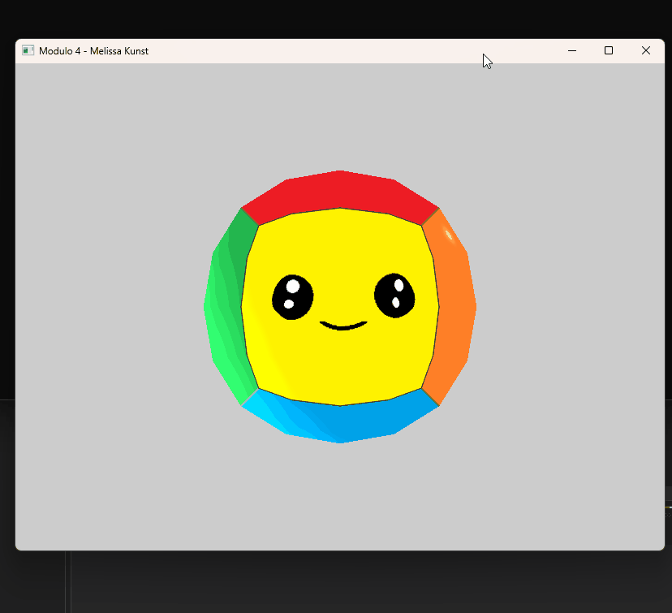
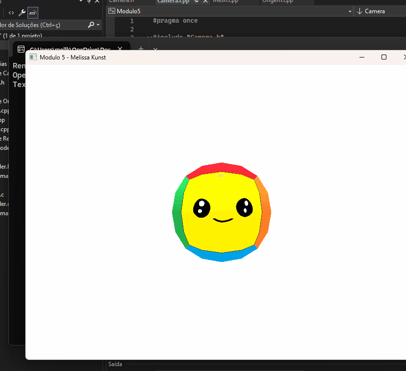

# Computação Gráfica - Melissa Kunst
Repositório criado para postar as atividadades de Computação Gráfica.

O módulo 1 esta na pasta Hello3D.

O restante dos trabalhos estão nas suas pastas nomeadas pelos módulos.

### Módulo 1

### Módulo 2

### Módulo 3

### Módulo 4

### Módulo 5

